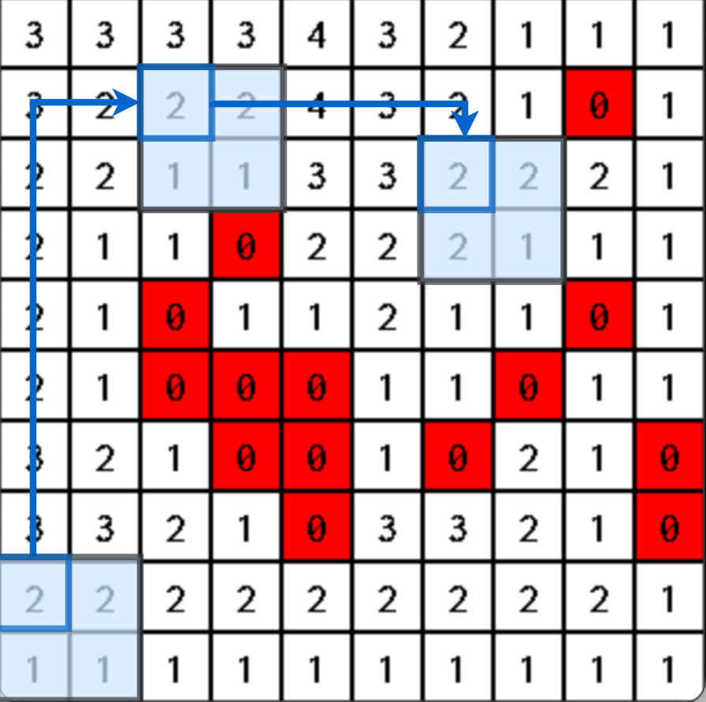
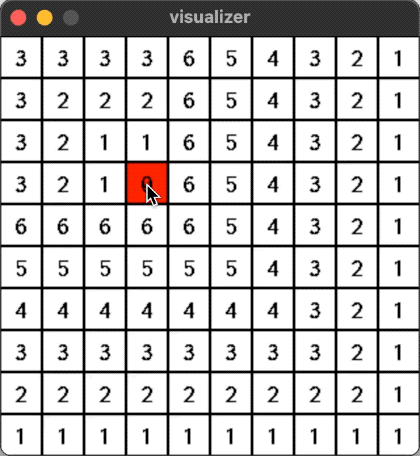
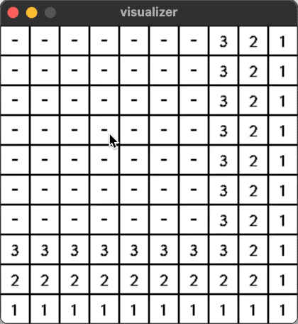
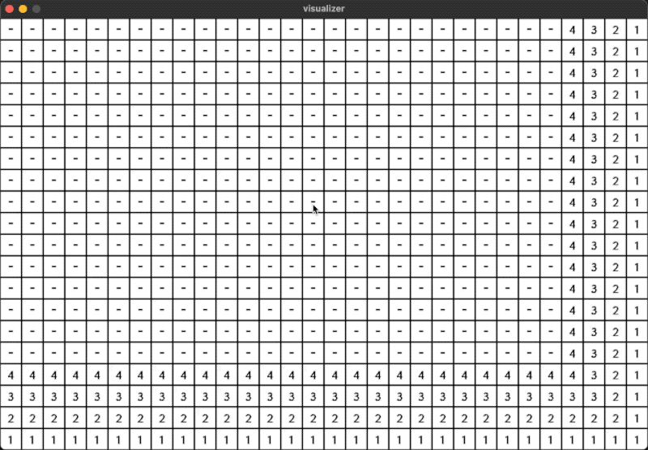

True Clearance Field
====================

A simple dynamical minimum obstacle distance (to the right and bottom) field library on equal-weighted 2D grid map.

Reference:

* The concept "true clearance" can be found at: https://web.archive.org/web/20190411040123/http://aigamedev.com/open/article/clearance-based-pathfinding
* The incremental updating mechanism is inspired by LPAStar algorithm: https://en.wikipedia.org/wiki/Lifelong_Planning_A*

The origin
~~~~~~~~~~

To solve the pathfinding problem of agents of different sizes in a 2D grid, for an example,
the 2x2 agent in the figure below always takes its upper left corner cell as its position, and then we consider the area that this position can pass through.
Each cell has a minimum obstacle distance value, which is the distance from the current cell to the nearest obstacle in the lower right quadrant.



Features in brief
~~~~~~~~~~~~~~~~~

* Updating is dynamical (incremental).
* Supports a distance bound, thus updates are only propagated within a limited neighborhood.

Demos
~~~~~

| <!-- -->                                                      | <!-- -->                                                    |
| ------------------------------------------------------------- | ----------------------------------------------------------- |
| without bound:        |   with bound `3`:   |
| larger map:   |

Code example
~~~~~~~~~~~~

```cpp
true_clearance_field::ObstacleChecker isObstacle = [](int x, int y) { return grid[x][y]; };
true_clearance_field::TrueClearanceField field(w, h, 1e5, 1, 1, isObstacle);
field.Build();

// Add obstacle at (x,y).
grid[x][y] = 1;
field.Update(x, y);

// Compute after any Update(s).
field.Compute();
```

License
~~~~~~~

BSD
